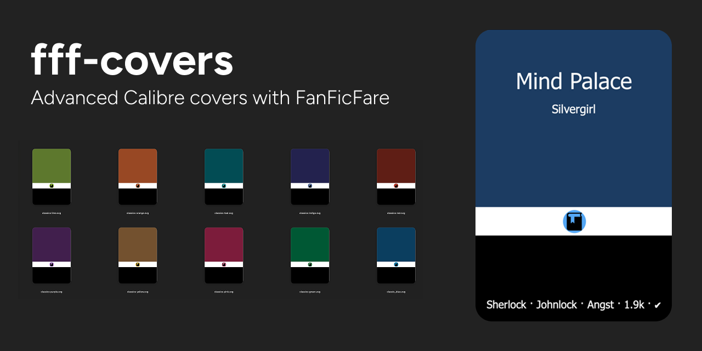

# fff-covers

If you have opinions about fanfic, a Calibre library that has gotten slightly out of hand, and a ~~nagging~~  persistent feeling that the default grey cover is a crime against aesthetics: this guide is for you.

**fff-covers** is a complete walkthrough for setting up automatic, fandom-aware cover generation for fanfiction downloaded with FanFicFare and managed in Calibre. By the end you'll have covers that know what fandom they belong to, who the ship is, whether it's a WIP, and how long it is — generated automatically, every time you download or update a story, without touching a single file manually.

***

## 📖 Read the guide

### **[wordsandpics.github.io/fff-covers](https://wordsandpics.github.io/fff-covers)**

***

## ⬇️ Downloads

**[Classics preset](code/classics_preset.zip)** — the starter Generate Cover preset used throughout the guide.

**[Color cover backgrounds](code/wordsandpics_classic_covers.zip)** — eight solid-color SVG backgrounds to use with the preset.

***

## What's covered

1. Basic covers — get something generating in under ten minutes
2. Per-fandom covers — different templates for different fandoms
3. Simple custom columns — map AO3 metadata to your Calibre library
4. Template columns — computed columns for short wordcount, genre tags, and ship names
5. Advanced ship tags — preserve author order with a personal.ini pipeline
6. Tips and tricks — metadata normalization, advanced cover rules, likeability score

***

## License

[MIT](LICENSE) — use it, adapt it, share it.
