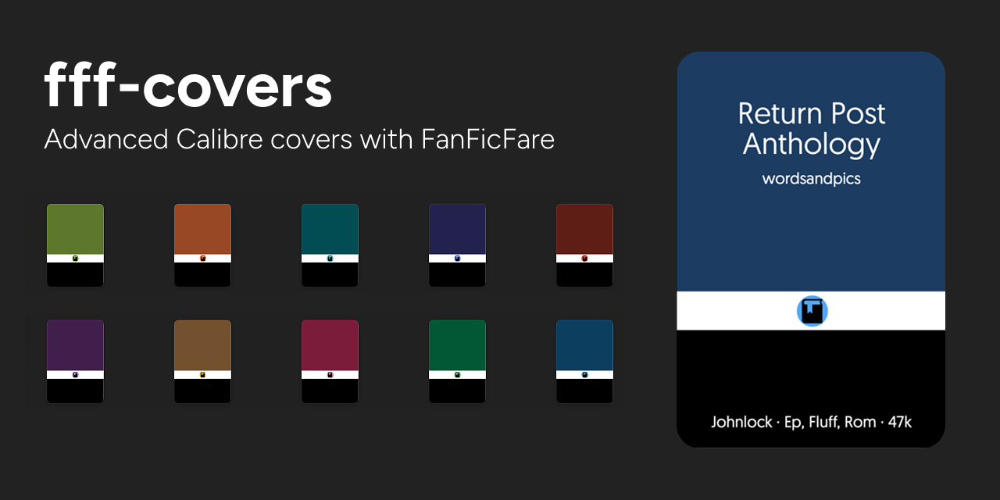

# fff-covers

If you have opinions about fanfic, a Calibre library that has gotten slightly out of hand, and a ~~nagging~~  persistent feeling that the default grey cover is a crime against aesthetics: this guide is for you.

**fff-covers** is a complete walkthrough for setting up automatic, fandom-aware cover generation for fanfiction downloaded with FanFicFare and managed in Calibre. By the end you'll have covers that know what fandom they belong to, who the ship is, whether it's a WIP, and how long it is — generated automatically, every time you download or update a story, without touching a single file manually.

***

## 📖 Read the guide

### **[wordsandpics.github.io/fff-covers](https://wordsandpics.github.io/fff-covers)**

***

## ⬇️ Downloads

**[Classics preset](code/classics_preset.zip)** — the starter Generate Cover preset used throughout the guide.

**[Colour cover backgrounds](code/wordsandpics_classic_covers.zip)** — optional SVG backgrounds in several colours. Extract the ZIP and select an individual SVG in Generate Cover.

***

## What's covered

1. Basic covers — get something generating in under ten minutes
2. Per-fandom covers — different templates for different fandoms
3. Simple custom columns — map AO3 metadata to your Calibre library
4. Template columns — computed columns for short wordcount, genre tags, and ship names
   - Genre generator — a companion tool for building keyphrase-to-genre templates
5. Advanced ship tags — preserve author order with a personal.ini pipeline
   - Short ship generator — a companion tool for creating customised ship templates without repetitive editing
6. Tips and tricks — metadata normalization, advanced cover rules, likeability score

***

## Changelog

### 15 September 2026

- Added a browser-based short ship generator with editable mappings, code import, previews, and templates for one to six ships.
- Corrected the advanced template so removing duplicate relationships keeps their original order.

### 14 September 2026

- Clarified the difference between importing the Generate Cover preset and extracting the optional background-image pack.
- Added guidance for editing the supplied SVGs to create personalised fandom covers.
- Reworked the advanced ship setup to save the full ordered relationship list and handle repeated anthology ships more reliably.
- Updated the downloadable snippets and added clearer migration and troubleshooting instructions.

***

## License

[MIT](LICENSE) — use it, adapt it, share it.
